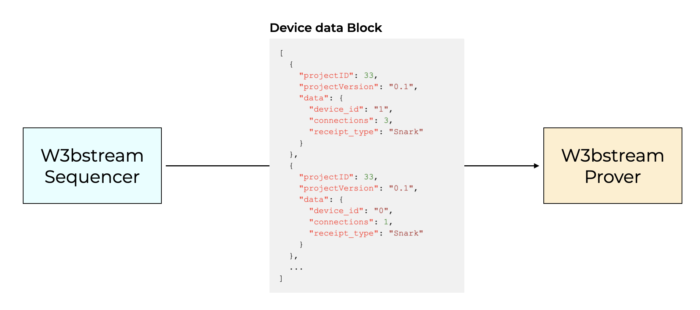

# IoTeX DeWi Demo

This repository consolidates all the code used to create the DeWi (Decentralized WiFi Network Infrastructure) demo we presented at R3al World 2024:

## Discalimer

This code is based on an early code release of W3bastream, the Layer-2 Rollup SDK from IoTeX. Several components and security features are still missing, and it is not intended to be used as a real dApp.

## Description of the demo

The objective of this demo is to build a basic (yet fully working) DeWi DePIN project, where the entire logic is fully decentralized and ensures end-to-end trust.

## Layers & Components

Like any DePIN project, this one is based on three main layers:

1. **Hardware Layer**
   At this layer, we have the actual devices of our DePIN project. Given that this is a DeWi project, the devices are WiFi access points. We have opted for the popular ESP32 board equipped with a 4-line LCD display to create our demo device.

    [Go to the Hardware Layer README ->](./esp32/README.md) 

2. **Off-chain processing Layer**
   This layer is responsible for computing the proof of "physical work" for each device based on the data it produces. This computation generates a "score" that is then used on-chain to distribute rewards to device owners. We utilized W3bstream as the infrastructure to provide data blocks sequencing and trusted computation. Currently, we do not implement any data storage policy, as no Data Availability layer is supported in W3bstream yet.
   
   [Go to the Layer-2 README ->](./w3bstream/README.md)

3. **On-chain token economy**
   This layer contains our on-chain logic that integrates with W3bstream to receive and validate the work performed by the devices, distributing rewards to their respective owners.

   [Go to the Layer-1 README ->](./blockchain/README.md)

## Overall architecture

## Flow

Below is a high level description of the end-to-end data flow:

1. Each device sends a message to a W3bstream sequencer every slot of 7 seconds:

2. The sequencer queues messages by destination project (`projectID`) according to the "aggregation amount" setting for the project to form a "block" of data messages. Once a block is full for a project it's handed over to a W3bstream prover:

3. The prover iterates over the whole block of messages and computes a score for each device id that accounts for its "work". In this demo the score is calculated as "1" score point for proof of liveness 8i.e. for each message), plus `N` where `N`is the the number of WiFi clients connected in that 7-seconds slot message. The result is a mapping device_id => score and the ZK proof of the computaion which is returned to the sequencer:
   

4. With the ZK proof returned, the sequencer submits it along with the block merkle root and the project's receiver address to the W3bstream router contract on-chain:

5. After some "logisitc" checks (was the submitter node registered? Was it whitelisted for the projectID? Was the receiver contract whitelisted?) the ZK proof an block merkle root are submitted to the receiver contract:

6. Finally, the receiver contract submits the proof along with the prover _Image ID_ (a unique identifier of the prover code) to the Risc Zero verifier contract:

7. Upon successful proof verification, the receiver contract will implemet a basic rewards distribution logic by processing the prover output. 

It simply looks up each device_id's owner in the device registry, and distributes as many "RewardTokens" as indicated by the `Score` value.

## W3bstream UI (Alpha)

For the deployment of our DePIN project's Layer-2 and Layer-1 logic, we utilized the W3bstream UI, available at [sandbox.w3bstream.com](https://sandbox.w3bstream.com).

## Limitations

### Blockchain
- **We did not actually test the Risc Zero verifier contract** and no example is provided in the WS repo. However, this seesm to be the official reference to understand how to make it: https://github.com/risc0/bonsai-foundry-template/blob/main/contracts/EvenNumber.sol

### W3bstream

- **No device identity management in W3bstream.** The current W3bstream Message protocol only expects a destination project (in the form of a `projectID` field), a project version and a payload `data` field. This means that a DePIN project has to implement their own device identification protocol into the payload but, because the only processing option for the payload is into a ZK prover, this leads to 2 big limitations: 1) Performing any digital signature verification is extremely expensive in ZK to the point of defeating any benefits of zk to scalability, and 2) ZK has no access to the blockchain so no auth is possible.

- **No DA layer is supported** (at the time when the demo has been created). As a consequence, there is no mechanism in place to store the block of data and a defined way to retrieve it 1-1 given the ZK proof written on chain.

- **Only one prover can configured for a project**. In the current WS configuration, each config file includes one prover's code and one receiver contract. It's reasonable to assume that (in the future) the project configuration will be different from the provers configuartion, such that each project may include multiple provers and each prover will have it's own receiver contract and aggregation amount, and the messaging protocol will support a target prover id in addition to the target project id (this can be seen as similar concept to the former "event id" in the previous devnet).

- **Risc Zero journal encoding.** This [example code](https://github.com/risc0/bonsai-foundry-template/blob/cbd385dac5fa68f6d1f7fae38184e235b0d7afd5/contracts/EvenNumber.sol#L45) seems to tell us that the risc zero journal is nothing more than the abi-encode of the prover outputs: the w3bstream risc0 image should be improved to return the journal in a more convenient format such that the receiver contract should just recover the data with an `abi.decode(journal, ...)`

### Firmware

- **We did not implement any "Witness" protocol** where other devices or user roles "attest" the actual network coverage of devices. We are trusting the user on actually positioning the device such that the WiFi is publicly accessible
  
- **We are trusting the device** on the actual proof of liveness and client loads. However, we have not implemented any trusted hardware patterns. Namely: using a secure element to generate a public/private key pair to sign data messages; we did not impleent secure boot neither firmware encription. Nevertheless, all these features should be possible on an ESP32-S3 or C3 (though they are not powerful enough to implement a commercial WiFi router).
   